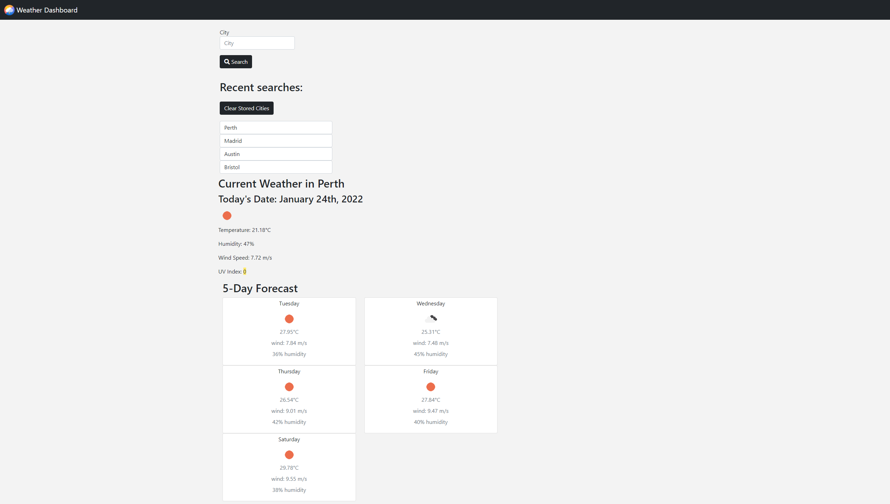

# 📔 Weather-Dashboard

A website made using HTML, CSS, Bootstrap, JS, Jquery, Moment JS & the Open Weather Api with the purpose of being able to search for a city and have the current days weather be displayed, along side a 5-day forecast. The user should also be able to have the previous searches saved and act as a quick link to display that cities weather again upon click.

# Features:

- Search input for a city
- Recent search with buttons to display that cities weather information upon click.
- Todays date displayed.
- Appealing icon based on what the weather's like currently.
- Temperature, humidity, wind speed and UV index displayed for the current day.
- 5 day forecast with temperture, wind speed, and humidity.

# 📑 [Deployed Website](https://wratten.github.io/Weather-Dashboard/)

